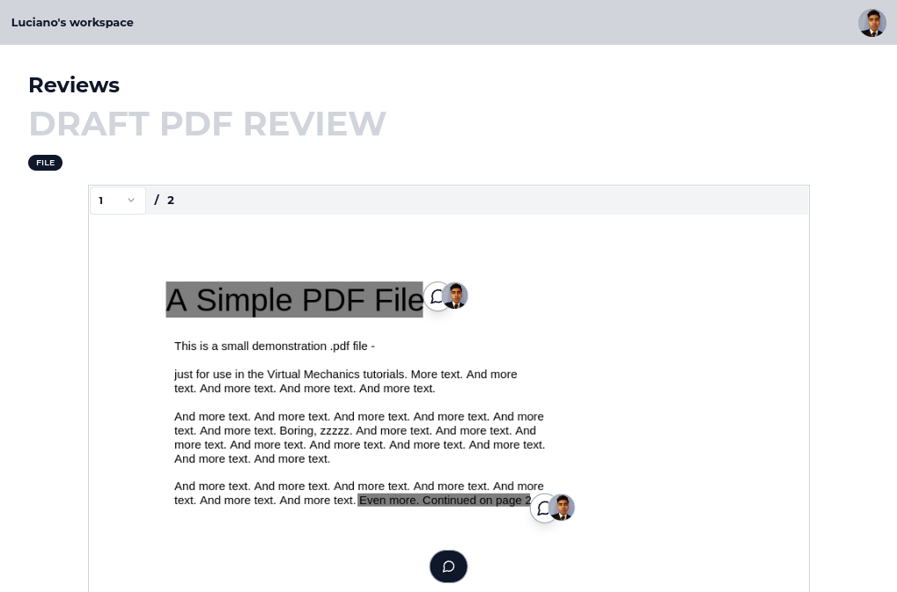

# review-c

An open-source review tool to review any website and files

## Introduction

review-c is an open-source tool to review any website and files in a collaborative way

### Website review

You can review any website by using our browser extension (it's only available for chrome by the moment)

### File review

You can review files such as .csv, .xlsx, .pdf and also images. This can be done using our dashboard, no extension is required

### Tech Stack

- Next.js - framework webapp
- Typescript - lang
- Shadcn - CSS
- Plasmo - browser extension framework
- Prisma - database orm
- Planetscale - database provider

### Author

- Luciano Alvarez ([@lcnlvrzproxy](https://twitter.com/lcnlvrzproxy))
